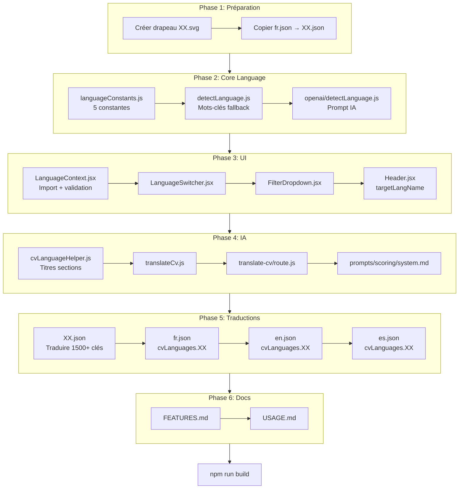

# Guide : Ajouter une nouvelle langue

Ce guide détaille **toutes** les étapes pour ajouter le support d'une nouvelle langue (ex: allemand `de`, italien `it`, portugais `pt`) à FitMyCV.

> **Basé sur** : L'ajout de l'espagnol (ES) en novembre 2025 - commits `91fd87b`, `57cbc03`, `d0af712`

## Vue d'ensemble

### Prérequis

- Accès au codebase FitMyCV
- Fichier de traduction de ~1500 clés (travail principal)
- Icône du drapeau au format SVG
- Liste de mots-clés pour la détection de langue

### Estimation d'effort

| Phase | Durée | Complexité |
|-------|-------|------------|
| Phase 1: Préparation | 30 min | Faible |
| Phase 2: Core Language | 30 min | Moyenne |
| Phase 3: UI & Composants | 20 min | Faible |
| Phase 4: Système IA | 20 min | Moyenne |
| Phase 5: Traductions | 1-2h | **Élevée** (1500+ clés) |
| Phase 6: Documentation | 10 min | Faible |
| **Total** | **~3h** | |

### Diagramme des dépendances



### Liste des fichiers à modifier (17 fichiers)

| # | Fichier | Description |
|---|---------|-------------|
| 1 | `public/icons/XX.svg` | Icône du drapeau |
| 2 | `locales/XX.json` | Traductions UI (1500+ clés) |
| 3 | `lib/cv/languageConstants.js` | 5 constantes de langue |
| 4 | `lib/cv/detectLanguage.js` | Détection fallback (mots-clés) |
| 5 | `lib/openai/detectLanguage.js` | Détection IA (prompt) |
| 6 | `lib/i18n/LanguageContext.jsx` | Import + validation |
| 7 | `components/LanguageSwitcher.jsx` | Sélecteur de langue |
| 8 | `components/TopBar/components/FilterDropdown.jsx` | Filtre CV |
| 9 | `components/Header.jsx` | Mapping traduction |
| 10 | `lib/i18n/cvLanguageHelper.js` | Titres sections CV |
| 11 | `lib/openai/translateCv.js` | Noms de langue |
| 12 | `app/api/background-tasks/translate-cv/route.js` | Validation API |
| 13 | `lib/openai/prompts/scoring/system.md` | Instruction langue |
| 14 | `locales/fr.json` | Clé inter-locale |
| 15 | `locales/en.json` | Clé inter-locale |
| 16 | `locales/es.json` | Clé inter-locale |
| 17 | `docs/FEATURES.md` + `docs/USAGE.md` | Documentation |

---

## Phase 1 : Préparation (30 min)

### 1.1 Créer l'icône du drapeau

**Fichier à créer** : `public/icons/XX.svg`

**IMPORTANT** : Les drapeaux doivent être **circulaires** (format 512x512) avec un contour subtil pour des bordures nettes.

**Structure standard** :
```xml
<svg xmlns="http://www.w3.org/2000/svg" viewBox="0 0 512 512">
  <defs>
    <clipPath id="circleClip">
      <circle cx="256" cy="256" r="256"/>
    </clipPath>
  </defs>
  <g clip-path="url(#circleClip)">
    <!-- Bandes du drapeau ici -->
  </g>
  <!-- Contour subtil pour bordures nettes -->
  <circle cx="256" cy="256" r="253" fill="none" stroke="#00000022" stroke-width="6"/>
</svg>
```

**Exemple (allemand - bandes horizontales)** :
```xml
<svg xmlns="http://www.w3.org/2000/svg" viewBox="0 0 512 512">
  <defs>
    <clipPath id="circleClip">
      <circle cx="256" cy="256" r="256"/>
    </clipPath>
  </defs>
  <g clip-path="url(#circleClip)">
    <rect x="0" y="0" width="512" height="172" fill="#000000"/>
    <rect x="0" y="170" width="512" height="172" fill="#DD0000"/>
    <rect x="0" y="340" width="512" height="172" fill="#FFCC00"/>
  </g>
  <circle cx="256" cy="256" r="253" fill="none" stroke="#00000022" stroke-width="6"/>
</svg>
```

**Exemple (français - bandes verticales)** :
```xml
<svg xmlns="http://www.w3.org/2000/svg" viewBox="0 0 512 512">
  <defs>
    <clipPath id="circleClip">
      <circle cx="256" cy="256" r="256"/>
    </clipPath>
  </defs>
  <g clip-path="url(#circleClip)">
    <rect x="0" y="0" width="172" height="512" fill="#002395"/>
    <rect x="170" y="0" width="172" height="512" fill="#fff"/>
    <rect x="340" y="0" width="172" height="512" fill="#ED2939"/>
  </g>
  <circle cx="256" cy="256" r="253" fill="none" stroke="#00000022" stroke-width="6"/>
</svg>
```

**Points clés** :
- ViewBox : `0 0 512 512` (carré)
- ClipPath circulaire : rayon 256, centré en (256, 256)
- Bandes avec léger chevauchement (évite les gaps d'anti-aliasing)
- Contour final : rayon 253, stroke semi-transparent `#00000022`, épaisseur 6px

### 1.2 Préparer le fichier de traduction

**Fichier à créer** : `locales/XX.json`

```bash
# Copier le fichier français comme base
cp locales/fr.json locales/XX.json
```

Le fichier contient ~1500 clés organisées en sections :
- `auth` - Authentification
- `topbar` - Barre de navigation
- `cvSections` - Titres des sections CV
- `optimization` - Panel d'optimisation
- `onboarding` - Tutoriel
- etc.

> **Note** : La traduction de ce fichier est le travail principal (~1-2h)

---

## Phase 2 : Core Language System (30 min)

### 2.1 Constantes de langue

**Fichier** : `lib/cv/languageConstants.js`

Ajouter la nouvelle langue dans **5 constantes** :

```javascript
/**
 * Language detection constants and utilities
 */

/**
 * Supported language codes for CV content
 */
export const SUPPORTED_LANGUAGES = {
  FR: 'fr',
  EN: 'en',
  ES: 'es',
  DE: 'de',  // NOUVEAU
};

/**
 * Language name mappings for display (utilisé dans les prompts OpenAI)
 */
export const LANGUAGE_NAMES = {
  [SUPPORTED_LANGUAGES.FR]: 'français',
  [SUPPORTED_LANGUAGES.EN]: 'anglais',
  [SUPPORTED_LANGUAGES.ES]: 'español',
  [SUPPORTED_LANGUAGES.DE]: 'deutsch',  // NOUVEAU
};

/**
 * Flag icon paths for each supported language
 */
export const LANGUAGE_FLAGS = {
  [SUPPORTED_LANGUAGES.FR]: '/icons/fr.svg',
  [SUPPORTED_LANGUAGES.EN]: '/icons/gb.svg',
  [SUPPORTED_LANGUAGES.ES]: '/icons/es.svg',
  [SUPPORTED_LANGUAGES.DE]: '/icons/de.svg',  // NOUVEAU
};

/**
 * Display labels for language selection UI
 */
export const LANGUAGE_LABELS = {
  [SUPPORTED_LANGUAGES.FR]: 'Français',
  [SUPPORTED_LANGUAGES.EN]: 'English',
  [SUPPORTED_LANGUAGES.ES]: 'Español',
  [SUPPORTED_LANGUAGES.DE]: 'Deutsch',  // NOUVEAU
};

/**
 * Keywords used to normalize language input strings
 */
export const LANGUAGE_KEYWORDS = {
  [SUPPORTED_LANGUAGES.FR]: ['français', 'french', 'france', 'fr'],
  [SUPPORTED_LANGUAGES.EN]: ['anglais', 'english', 'anglaise', 'en', 'eng'],
  [SUPPORTED_LANGUAGES.ES]: ['español', 'spanish', 'espagnol', 'es', 'esp'],
  [SUPPORTED_LANGUAGES.DE]: ['deutsch', 'german', 'allemand', 'de', 'ger'],  // NOUVEAU
};
```

### 2.2 Détection fallback par mots-clés

**Fichier** : `lib/cv/detectLanguage.js`

Dans la fonction `detectCvLanguage()`, ajouter les mots-clés de la nouvelle langue :

```javascript
// Mots clés allemands (exemple)
const germanKeywords = [
  'erfahrung', 'fähigkeiten', 'ausbildung', 'abschluss', 'unternehmen',
  'position', 'verantwortlichkeiten', 'projekt', 'team', 'entwicklung',
  'management', 'jahr', 'monat', 'niveau', 'kenntnisse', 'derzeit',
  'seit', 'bei', 'mit', 'für', 'entwickler', 'ingenieur'
];

// Ajouter le compteur
let germanCount = 0;

germanKeywords.forEach(keyword => {
  const matches = textToAnalyze.match(new RegExp(keyword, 'g'));
  if (matches) germanCount += matches.length;
});

// Détecter les caractères spécifiques allemands (ß, ü, ö, ä)
const germanSpecificChars = textToAnalyze.match(/[ßüöä]/g);
if (germanSpecificChars) {
  germanCount += germanSpecificChars.length * 3;
}

// Ajouter la logique de retour
if (germanCount > frenchCount && germanCount > englishCount && germanCount > spanishCount) {
  return 'de';
}
```

Même modification dans `detectJobOfferLanguage()` avec des mots-clés d'offres d'emploi :

```javascript
const germanJobKeywords = [
  'stellenangebot', 'stelle', 'position', 'profil', 'suchen',
  'aufgaben', 'anforderungen', 'erfahrung', 'kenntnisse', 'unternehmen',
  'bewerber', 'vertrag', 'vollzeit', 'gehalt', 'vorteile'
];
```

Et dans `getLanguageName()` :

```javascript
export function getLanguageName(languageCode) {
  const names = {
    fr: 'français',
    en: 'anglais',
    en_US: 'anglais',
    es: 'español',
    de: 'deutsch',  // NOUVEAU
  };
  return names[languageCode] || 'français';
}
```

### 2.3 Détection OpenAI

**Fichier** : `lib/openai/detectLanguage.js`

Modifier le prompt système et la validation :

```javascript
// Ligne ~46 - Mettre à jour le prompt
{
  role: 'system',
  content: 'You are a language detection assistant. Analyze the text and respond with ONLY "fr" for French, "en" for English, "es" for Spanish, or "de" for German. No other text.'
}

// Ligne ~64 - Mettre à jour la validation
const validLanguages = ['fr', 'en', 'es', 'de'];
const detectedLanguage = validLanguages.includes(content) ? content : 'fr';
```

---

## Phase 3 : UI & Composants (20 min)

### 3.1 Context i18n

**Fichier** : `lib/i18n/LanguageContext.jsx`

```javascript
// Ajouter l'import
import deTranslations from "@/locales/de.json";

// Ajouter au mapping
const translations = {
  fr: frTranslations,
  en: enTranslations,
  es: esTranslations,
  de: deTranslations,  // NOUVEAU
};

// Ligne ~26 - Mettre à jour la validation
if (savedLanguage && ["fr", "en", "es", "de"].includes(savedLanguage)) {
```

### 3.2 Sélecteur de langue

**Fichier** : `components/LanguageSwitcher.jsx`

```javascript
const languages = [
  { code: "fr", flag: "/icons/fr.svg", label: "Français" },
  { code: "en", flag: "/icons/gb.svg", label: "English" },
  { code: "es", flag: "/icons/es.svg", label: "Español" },
  { code: "de", flag: "/icons/de.svg", label: "Deutsch" },  // NOUVEAU
];
```

### 3.3 Filtre CV par langue

**Fichier** : `components/TopBar/components/FilterDropdown.jsx`

```javascript
const CV_LANGUAGES = [
  { id: null, key: "all" },
  { id: "fr", key: "fr" },
  { id: "en", key: "en" },
  { id: "es", key: "es" },
  { id: "de", key: "de" },  // NOUVEAU
];
```

### 3.4 Mapping traduction Header

**Fichier** : `components/Header.jsx`

Dans la fonction de traduction (~ligne 382) :

```javascript
const targetLangName = {
  fr: 'français',
  en: 'anglais',
  es: 'español',
  de: 'deutsch'  // NOUVEAU
}[targetLanguage] || targetLanguage;
```

---

## Phase 4 : Système IA (20 min)

### 4.1 Titres de sections CV

**Fichier** : `lib/i18n/cvLanguageHelper.js`

```javascript
// Ajouter l'import
import deTranslations from '@/locales/de.json';

// Ajouter au mapping
const translations = {
  fr: frTranslations,
  en: enTranslations,
  es: esTranslations,
  de: deTranslations,  // NOUVEAU
};

// Mettre à jour getTranslatorForCvLanguage
export function getTranslatorForCvLanguage(cvLanguage) {
  const lang = cvLanguage === 'en' ? 'en'
             : cvLanguage === 'es' ? 'es'
             : cvLanguage === 'de' ? 'de'  // NOUVEAU
             : 'fr';
  // ...
}

// Ajouter les titres par défaut allemands
const defaultTitlesDe = {
  header: ["Kopfzeile"],
  summary: ["Zusammenfassung"],
  experience: ["Berufserfahrung"],
  education: ["Ausbildung"],
  skills: ["Fähigkeiten", "Kompetenzen"],
  projects: ["Persönliche Projekte", "Projekte"],
  languages: ["Sprachen"],
  extras: ["Zusätzliche Informationen", "Extras"]
};

// Ajouter la vérification
const isGermanDefault = defaultTitlesDe[sectionKey] && defaultTitlesDe[sectionKey].includes(trimmedTitle);

if (isFrenchDefault || isEnglishDefault || isSpanishDefault || isGermanDefault) {
  return t(`cvSections.${sectionKey}`);
}
```

### 4.2 API Traduction

**Fichier** : `lib/openai/translateCv.js`

```javascript
// Ligne ~28 - Mapper le code langue vers le nom complet
const languageNames = {
  fr: 'français',
  en: 'anglais',
  es: 'español',
  de: 'deutsch'  // NOUVEAU
};
```

**Fichier** : `app/api/background-tasks/translate-cv/route.js`

```javascript
// Ligne ~52 - Validation
if (!targetLanguage || !['fr', 'en', 'es', 'de'].includes(targetLanguage)) {
  return NextResponse.json({ error: "Langue cible invalide." }, { status: 400 });
}
```

### 4.3 Prompts OpenAI

**Fichier** : `lib/openai/prompts/scoring/system.md`

```markdown
## LANGUE DE L'ANALYSE

**OBLIGATION ABSOLUE** : Tu DOIS rédiger TOUTE ton analyse dans la langue du CV : **{cvLanguage}**.
- Si le CV est en français → analyse en français
- Si le CV est en anglais → analyse en anglais
- Si le CV est en español → analyse en español
- Si le CV est en deutsch → analyse en deutsch  // NOUVEAU
```

> **Note** : Les fichiers `prompts/improve-cv/user.md` et `prompts/scoring/user.md` utilisent la variable `{cvLanguage}` dynamiquement et n'ont pas besoin de modification.

---

## Phase 5 : Traductions inter-locales (1h+)

### 5.1 Traduire le fichier principal

**Fichier** : `locales/XX.json`

Traduire les ~1500 clés. Sections principales :

```json
{
  "auth": { ... },
  "topbar": { ... },
  "cvSections": {
    "header": "Kopfzeile",
    "summary": "Zusammenfassung",
    "experience": "Berufserfahrung",
    "education": "Ausbildung",
    "skills": "Fähigkeiten",
    "projects": "Projekte",
    "languages": "Sprachen",
    "extras": "Extras"
  },
  "optimization": { ... },
  "onboarding": { ... }
}
```

### 5.2 Ajouter les clés inter-locales

**IMPORTANT** : Quand vous ajoutez une langue XX, vous devez aussi ajouter des clés dans **tous les locales existants**.

**Fichier** : `locales/fr.json`

```json
{
  "topbar": {
    "cvLanguages": {
      "fr": "Français",
      "en": "English",
      "es": "Español",
      "de": "Allemand",
      "all": "Toutes"
    }
  }
}
```

**Fichier** : `locales/en.json`

```json
{
  "topbar": {
    "cvLanguages": {
      "fr": "Français",
      "en": "English",
      "es": "Spanish",
      "de": "German",
      "all": "All"
    }
  }
}
```

**Fichier** : `locales/es.json`

```json
{
  "topbar": {
    "cvLanguages": {
      "fr": "Français",
      "en": "English",
      "es": "Español",
      "de": "Alemán",
      "all": "Todos"
    }
  }
}
```

**Fichier** : `locales/XX.json` (le nouveau)

```json
{
  "topbar": {
    "cvLanguages": {
      "fr": "Français",
      "en": "English",
      "es": "Español",
      "de": "Deutsch",
      "all": "Alle"
    }
  }
}
```

---

## Phase 6 : Documentation (10 min)

### 6.1 FEATURES.md

**Fichier** : `docs/FEATURES.md`

Mettre à jour la section "Langues supportées" :

```markdown
### Langues supportées

- Français (fr)
- Anglais (en)
- Espagnol (es)
- Allemand (de)
```

### 6.2 USAGE.md

**Fichier** : `docs/USAGE.md`

Mettre à jour la section traduction si nécessaire.

---

## Pièges courants

### 1. Oublier les clés inter-locales

**Symptôme** : Le filtre par langue affiche `topbar.cvLanguages.de` au lieu de "Allemand".

**Solution** : Ajouter `topbar.cvLanguages.XX` dans **tous** les fichiers locales existants (fr, en, es).

### 2. Validation incohérente

**Symptôme** : La traduction vers la nouvelle langue échoue avec "Langue cible invalide".

**Solution** : Vérifier que la langue est ajoutée dans :
- `translate-cv/route.js` (validation API)
- `LanguageContext.jsx` (validation localStorage)
- `lib/openai/detectLanguage.js` (validLanguages)

### 3. Mots-clés fallback insuffisants

**Symptôme** : Les CVs dans la nouvelle langue sont détectés comme français.

**Solution** :
- Ajouter plus de mots-clés spécifiques
- Ajouter les caractères spéciaux de la langue avec un poids élevé (×3)

### 4. Oublier le mapping Header.jsx

**Symptôme** : Lors de la traduction, le message affiche le code langue (`de`) au lieu du nom (`deutsch`).

**Solution** : Ajouter le mapping dans `components/Header.jsx` ligne ~382.

### 5. Titres de sections CV non traduits

**Symptôme** : Les sections du CV affichent les titres en français malgré un CV dans une autre langue.

**Solution** : Ajouter `defaultTitlesXX` dans `lib/i18n/cvLanguageHelper.js`.

---

## Tests de validation

### Checklist de tests manuels

Après avoir ajouté la nouvelle langue, effectuer ces tests :

- [ ] **Interface** : Changer la langue vers la nouvelle langue dans le sélecteur en bas à gauche
- [ ] **Traductions UI** : Naviguer sur toutes les pages, vérifier qu'aucune clé n'est affichée brute
- [ ] **Filtre CV** : Ouvrir le filtre, vérifier que la nouvelle langue apparaît avec son nom traduit
- [ ] **Création CV** : Créer un nouveau CV avec du contenu dans la nouvelle langue
- [ ] **Détection langue** : Vérifier que le CV créé a bien `language: "XX"` dans ses métadonnées
- [ ] **Traduction vers** : Traduire un CV existant vers la nouvelle langue
- [ ] **Traduction depuis** : Traduire un CV dans la nouvelle langue vers une autre langue
- [ ] **Match score** : Calculer un score de match, vérifier que l'analyse est dans la langue du CV
- [ ] **Optimisation** : Optimiser un CV, vérifier que les suggestions sont dans la langue du CV
- [ ] **Build** : Exécuter `npm run build` sans erreurs

### Commande de test

```bash
# Vérifier que le build passe
npm run build

# Démarrer le serveur de développement
npm run dev

# Ouvrir http://localhost:3001 et tester manuellement
```

---

## Checklist finale

### Phase 1 : Préparation
- [ ] `public/icons/XX.svg` - Icône du drapeau créée

### Phase 2 : Core Language
- [ ] `lib/cv/languageConstants.js` - 5 constantes ajoutées
- [ ] `lib/cv/detectLanguage.js` - Mots-clés + caractères spéciaux + getLanguageName
- [ ] `lib/openai/detectLanguage.js` - Prompt + validLanguages

### Phase 3 : UI & Composants
- [ ] `lib/i18n/LanguageContext.jsx` - Import + validation
- [ ] `components/LanguageSwitcher.jsx` - Option dans le tableau
- [ ] `components/TopBar/components/FilterDropdown.jsx` - CV_LANGUAGES
- [ ] `components/Header.jsx` - Mapping targetLangName

### Phase 4 : Système IA
- [ ] `lib/i18n/cvLanguageHelper.js` - Import + getTranslator + defaultTitles
- [ ] `lib/openai/translateCv.js` - languageNames
- [ ] `app/api/background-tasks/translate-cv/route.js` - Validation
- [ ] `lib/openai/prompts/scoring/system.md` - Instruction langue

### Phase 5 : Traductions
- [ ] `locales/XX.json` - Fichier complet traduit (~1500 clés)
- [ ] `locales/fr.json` - `topbar.cvLanguages.XX` ajouté
- [ ] `locales/en.json` - `topbar.cvLanguages.XX` ajouté
- [ ] `locales/es.json` - `topbar.cvLanguages.XX` ajouté

### Phase 6 : Documentation & Tests
- [ ] `docs/FEATURES.md` - Langue ajoutée
- [ ] `docs/USAGE.md` - Mis à jour si nécessaire
- [ ] `npm run build` - Build réussi
- [ ] Tests manuels passés

---

## Référence : Commits d'exemple

Pour voir des exemples complets des fichiers modifiés, consulter les commits d'ajout de langues :

### Allemand (DE) - Novembre 2025

```bash
# Branche: improvement/add_allemand
# Implémentation complète avec drapeaux circulaires optimisés
git log improvement/add_allemand
```

### Espagnol (ES) - Novembre 2025

```bash
# Voir le commit principal (20 fichiers, +2039 lignes)
git show 91fd87b

# Voir le fix des clés inter-locales
git show d0af712

# Voir le fix pour l'analyse IA en langue du CV
git show 57cbc03
```
