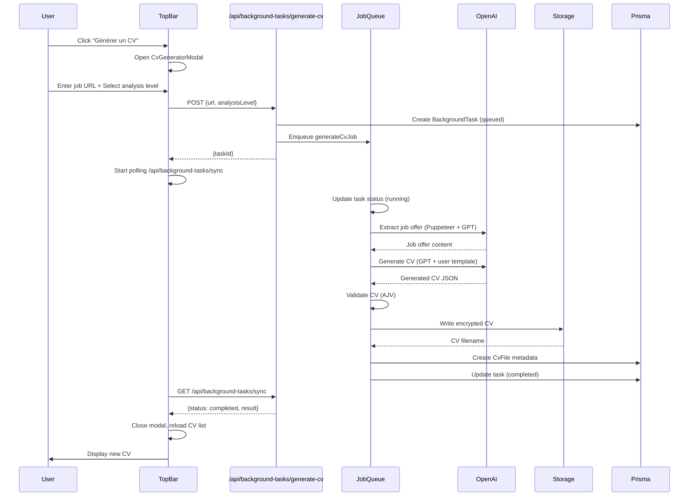
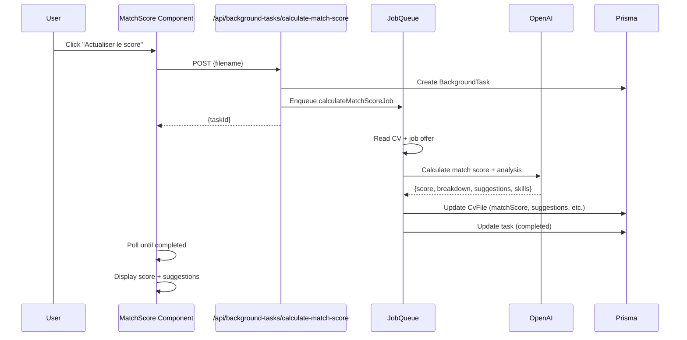
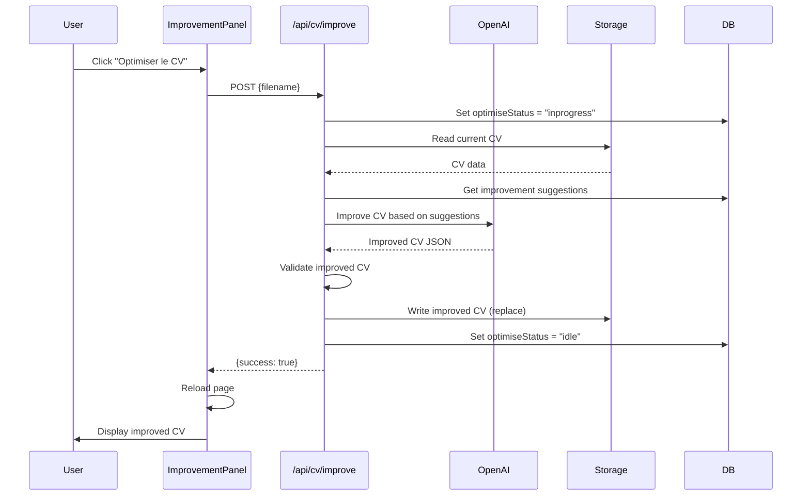
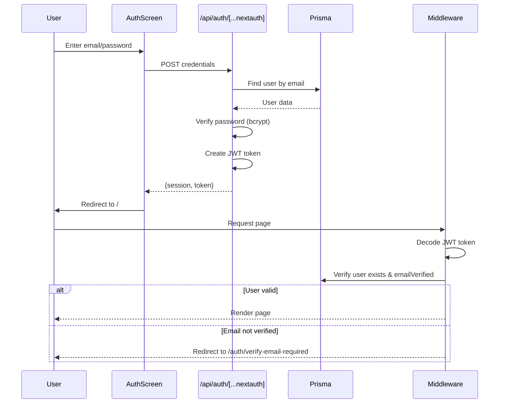

# Architecture - FitMyCv.ai

Ce document décrit en détail l'architecture de l'application FitMyCv.ai.

---

## Table des matières

- [Vue d'ensemble](#vue-densemble)
- [Architecture Next.js 14](#architecture-nextjs-14)
- [Structure des dossiers](#structure-des-dossiers)
- [Flux de données principaux](#flux-de-données-principaux)
- [Patterns et conventions](#patterns-et-conventions)
- [Optimisations performance](#optimisations-performance)

---

## Vue d'ensemble

FitMyCv.ai est construite sur une architecture moderne basée sur **Next.js 14** avec l'**App Router**.

### Architecture globale

```
┌─────────────────────────────────────────────────────────────┐
│                    CLIENT (Browser)                          │
│  - React 18 Components                                       │
│  - Tailwind CSS Styling                                      │
│  - NextAuth Session Management                               │
└────────────────┬────────────────────────────────────────────┘
                 │
                 │ HTTP/HTTPS
                 │
┌────────────────▼────────────────────────────────────────────┐
│               NEXT.JS 14 SERVER                              │
│                                                              │
│  ┌──────────────┐  ┌──────────────┐  ┌──────────────┐      │
│  │ Pages (SSR)  │  │ API Routes   │  │ Middleware   │      │
│  │ App Router   │  │ 60+ endpoints│  │ Auth, Rate   │      │
│  └──────────────┘  └──────────────┘  └──────────────┘      │
│                                                              │
│  ┌──────────────────────────────────────────────────────┐  │
│  │            Background Job Queue                      │  │
│  │  - Max 3 concurrent jobs                             │  │
│  │  - Types: generate-cv, import-pdf, translate, etc.   │  │
│  └──────────────────────────────────────────────────────┘  │
└──────────┬───────────────┬──────────────┬──────────────────┘
           │               │              │
           │               │              │
┌──────────▼─────┐  ┌──────▼──────┐  ┌───▼──────────┐
│   PRISMA ORM   │  │  OPENAI API │  │  PUPPETEER   │
│   SQLite/PG    │  │  GPT-5      │  │  Scraping    │
│   28 Models    │  │  Models     │  │  PDF Export  │
└────────────────┘  └─────────────┘  └──────────────┘
```

### Couches de l'application

| Couche | Responsabilité | Technologies |
|--------|---------------|--------------|
| **Présentation** | UI/UX, Composants React | React 18, Tailwind CSS |
| **Application** | Logique métier, Routes | Next.js 14 App Router |
| **Services** | Intégrations externes | OpenAI SDK, Puppeteer, Resend |
| **Données** | Persistance, ORM | Prisma 6, SQLite/PostgreSQL |
| **Infrastructure** | Auth, Sécurité, Cache | NextAuth, Middleware, Headers |

---

## Architecture Next.js 14

### App Router Structure

FitMyCv.ai utilise le nouveau **App Router** de Next.js 14 (pas le Pages Router).

```
app/
├── layout.jsx                    # Layout racine (RootProviders)
├── page.jsx                      # Page d'accueil (viewer CV)
├── globals.css                   # Styles globaux
│
├── auth/                         # Pages authentification
│   ├── layout.jsx               # Layout auth partagé
│   ├── page.jsx                 # Login/Register
│   ├── complete-signin/page.jsx # Auto sign-in après vérification
│   ├── forgot-password/page.jsx # Demande reset mdp
│   ├── reset-password/page.jsx  # Reset mdp avec token
│   ├── verify-email/page.jsx    # Vérification email
│   └── verify-email-required/page.jsx # Email non vérifié
│
├── account/                      # Paramètres compte
│   └── page.jsx                 # Settings utilisateur
│
├── admin/                        # Dashboard admin
│   ├── analytics/page.jsx       # Analytics avancées
│   └── new/page.jsx             # Nouveau dashboard
│
├── cookies/page.jsx              # Gestion cookies RGPD
├── privacy/page.jsx              # Politique confidentialité
│
└── api/                          # API Routes (voir section API)
```

### Rendering Strategy

| Type de page | Strategy | Raison |
|--------------|----------|--------|
| **/** (home) | Server Component | Données CV dynamiques |
| **/auth*** | Client Component | Interactivité formulaires |
| **/account** | Client Component | Settings interactifs |
| **/admin*** | Client Component | Dashboard interactif |
| **/api/*** | Server-side | API endpoints |

### Providers Hierarchy

```jsx
// app/layout.jsx
<html>
  <body>
    <RootProviders>                    {/* Context global */}
      <RecaptchaProvider>              {/* reCAPTCHA v3 */}
        <NotificationProvider>         {/* Notifications */}
          <BackgroundTasksProvider>    {/* Tâches background */}
            <HighlightProvider>        {/* Highlight CV */}
              <GlobalBackground />
              <ConditionalTopBar />
              {children}
              <ConditionalFooter />
            </HighlightProvider>
          </BackgroundTasksProvider>
        </NotificationProvider>
      </RecaptchaProvider>
    </RootProviders>
  </body>
</html>
```

---

## Structure des dossiers

### Vue complète

```
cv-site/
├── app/                          # Next.js App Router
│   ├── api/                     # API Routes (60+ endpoints)
│   │   ├── auth/               # Authentication
│   │   ├── cv/                 # CV management
│   │   ├── cvs/                # CVs CRUD
│   │   ├── background-tasks/   # Jobs asynchrones
│   │   ├── admin/              # Administration
│   │   ├── analytics/          # Analytics data
│   │   ├── account/            # Account settings
│   │   ├── feedback/           # User feedback
│   │   ├── consent/            # Cookie consent
│   │   ├── telemetry/          # Telemetry tracking
│   │   └── export-pdf/         # PDF export
│   └── [pages]/                # Pages Next.js
│
├── components/                   # React Components (100+ fichiers)
│   ├── TopBar/                  # Navigation principale
│   │   ├── TopBar.jsx          # Composant principal
│   │   ├── modals/             # Modals (generator, export, etc.)
│   │   ├── hooks/              # Hooks TopBar
│   │   └── utils/              # Utilitaires TopBar
│   ├── ui/                      # Composants UI réutilisables
│   ├── admin/                   # Composants admin/analytics
│   ├── auth/                    # Composants authentification
│   ├── subscription/            # Composants abonnements/crédits (10 composants)
│   ├── feedback/                # Système feedback
│   ├── cookies/                 # Gestion cookies RGPD
│   ├── account/                 # Paramètres compte
│   ├── notifications/           # Notifications système
│   ├── [CV Components]/         # Affichage CV
│   │   ├── Header.jsx
│   │   ├── Summary.jsx
│   │   ├── Skills.jsx
│   │   ├── Experience.jsx
│   │   ├── Education.jsx
│   │   └── ...
│   └── [Providers]/             # Context providers
│
├── lib/                          # Bibliothèques & Utilitaires
│   ├── auth/                    # NextAuth config
│   │   ├── options.js          # Auth options (providers, callbacks)
│   │   ├── session.js          # Session management
│   │   └── autoSignIn.js       # Auto sign-in tokens
│   ├── cv/                      # CV Management
│   │   ├── crypto.js           # AES-256-GCM encryption
│   │   ├── storage.js          # Read/Write encrypted CVs
│   │   ├── validation.js       # AJV validation
│   │   ├── source.js           # Source metadata
│   │   └── detectLanguage.js   # Language detection
│   ├── backgroundTasks/         # Job Queue System
│   │   ├── jobQueue.js         # Queue manager (3 concurrent)
│   │   ├── [jobs]/             # Job runners
│   │   │   ├── generateCvJob.js
│   │   │   ├── importPdfJob.js
│   │   │   ├── translateCvJob.js
│   │   │   ├── improveCvJob.js
│   │   │   └── ...
│   │   └── processRegistry.js  # Process tracking
│   ├── openai/                  # OpenAI Integration
│   │   ├── client.js           # OpenAI client (rate limiting)
│   │   ├── promptLoader.js     # Prompt management
│   │   ├── [functions]/        # AI functions
│   │   │   ├── generateCv.js
│   │   │   ├── importPdf.js
│   │   │   ├── translateCv.js
│   │   │   ├── improveCv.js
│   │   │   ├── calculateMatchScore.js
│   │   │   └── ...
│   │   └── prompts/            # Prompt templates organized by feature
│   ├── security/                # Security utilities
│   │   ├── passwordPolicy.js   # Password validation
│   │   ├── secureLogger.js     # Secure logging
│   │   ├── fileValidation.js   # File validation
│   │   └── xssSanitization.js  # XSS prevention
│   ├── analytics/               # Analytics & Telemetry
│   │   ├── featureConfig.js    # Feature analytics config
│   │   └── filters.js          # Analytics filters
│   ├── telemetry/               # Telemetry tracking
│   │   ├── server.js           # Server-side tracking
│   │   └── openai.js           # OpenAI usage tracking
│   ├── admin/                   # Admin utilities
│   │   ├── settingsConfig.js   # Settings configuration
│   │   └── userManagement.js   # User management
│   ├── settings/                # Settings utilities
│   │   ├── aiModels.js         # AI models config
│   │   └── settingsUtils.js    # Settings helpers
│   ├── cookies/                 # Cookie consent
│   │   ├── consent.js          # Consent management
│   │   ├── consentLogger.js    # Consent logging
│   │   ├── registry.js         # Cookie registry
│   │   └── useCookieConsent.js # Consent hook
│   ├── email/                   # Email service
│   │   └── emailService.js     # Resend integration
│   ├── events/                  # Event system
│   │   ├── dbEmitter.js        # DB event emitter
│   │   └── prismaWithEvents.js # Prisma with events
│   ├── user/                    # User utilities
│   │   └── deletion.js         # User deletion
│   ├── i18n/                    # Internationalization
│   │   └── cvLabels.js         # CV labels translation
│   ├── subscription/            # Subscription & Credits System
│   │   ├── credits.js          # Credit management (debit, refund, grant)
│   │   ├── featureUsage.js     # Feature limits & counters
│   │   ├── cvLimits.js         # CV limits with credits
│   │   ├── subscriptions.js    # Subscription management
│   │   ├── stripeSync.js       # Stripe products synchronization
│   │   ├── planUtils.js        # Plan utilities and helpers
│   │   └── planTranslations.js # Plan name/description translations
│   ├── stripe.js                # Stripe client singleton
│   ├── prisma.js                # Prisma client singleton
│   ├── sanitize.js              # Generic sanitization
│   ├── site.js                  # Site constants
│   └── utils.js                 # Generic utilities
│
├── prisma/                       # Database
│   ├── schema.prisma            # Prisma schema (28 models)
│   ├── migrations/              # Database migrations (15)
│   ├── dev.db                   # SQLite database (dev)
│   └── seed.js                  # Database seeding
│
├── data/                         # Application data
│   ├── schema.json              # CV JSON schema (AJV)
│   ├── template.json            # CV template structure
│   └── users/                   # User data (encrypted CVs)
│       └── [userId]/
│           └── cvs/
│               └── [filename].json  # Encrypted CV files
│
├── public/                       # Static assets
│   ├── favicon.ico
│   └── [images]
│
├── docs/                         # Documentation
│   ├── README.md                # Documentation index
│   ├── INSTALLATION.md          # Installation guide
│   ├── ARCHITECTURE.md          # This file
│   └── [other docs]
│
├── scripts/                      # Utility scripts
│   └── backfill-telemetry.mjs  # Telemetry backfill
│
├── hooks/                        # Custom React hooks
│
├── locales/                      # Translation files
│
├── middleware.js                 # Next.js middleware (auth, rate limit)
├── instrumentation.js            # Next.js instrumentation hook
├── next.config.js                # Next.js configuration
├── tailwind.config.js            # Tailwind CSS configuration
├── postcss.config.js             # PostCSS configuration
├── .env.local                    # Environment variables (dev)
└── package.json                  # Dependencies & scripts
```

---

## Flux de données principaux

### 1. Génération de CV depuis une offre d'emploi



### 2. Calcul du Match Score



### 3. Optimisation de CV



### 4. Authentification & Session



---

## Patterns et conventions

### 1. API Routes Pattern

Toutes les routes API suivent cette structure :

```javascript
// app/api/[feature]/route.js
import { NextResponse } from 'next/server';
import { getSession } from '@/lib/auth/session';
import prisma from '@/lib/prisma';

export async function GET(request) {
  try {
    // 1. Authentification
    const session = await getSession();
    if (!session?.user?.id) {
      return NextResponse.json({ error: 'Non autorisé' }, { status: 401 });
    }

    // 2. Validation des paramètres
    const { searchParams } = new URL(request.url);
    const param = searchParams.get('param');
    if (!param) {
      return NextResponse.json({ error: 'Paramètre manquant' }, { status: 400 });
    }

    // 3. Logique métier
    const data = await prisma.model.findMany({
      where: { userId: session.user.id }
    });

    // 4. Réponse
    return NextResponse.json({ data });

  } catch (error) {
    console.error('[api] Erreur:', error);
    return NextResponse.json(
      { error: 'Erreur serveur' },
      { status: 500 }
    );
  }
}
```

### 2. Background Job Pattern

```javascript
// lib/backgroundTasks/[type]Job.js
import { trackTelemetry } from '@/lib/telemetry/server';
import { functionFromOpenAI } from '@/lib/openai/[function]';

export async function run[Type]Job(task) {
  const startTime = Date.now();

  try {
    // 1. Parse payload
    const payload = JSON.parse(task.payload || '{}');

    // 2. Execute AI function
    const result = await functionFromOpenAI(payload);

    // 3. Save result
    await saveResult(result);

    // 4. Track telemetry
    await trackTelemetry({
      type: 'JOB_COMPLETED',
      userId: task.userId,
      duration: Date.now() - startTime,
      status: 'success'
    });

    return { success: true, result };

  } catch (error) {
    await trackTelemetry({
      type: 'JOB_FAILED',
      userId: task.userId,
      duration: Date.now() - startTime,
      status: 'error',
      error: error.message
    });

    throw error;
  }
}
```

### 3. Component Pattern

```javascript
// components/[Component].jsx
'use client'; // Si interactif

import { useState, useEffect } from 'react';

export default function Component({ prop1, prop2 }) {
  // 1. State
  const [state, setState] = useState(null);

  // 2. Effects
  useEffect(() => {
    // Logique d'initialisation
  }, []);

  // 3. Handlers
  const handleAction = async () => {
    // Logique métier
  };

  // 4. Render
  return (
    <div className="...">
      {/* JSX */}
    </div>
  );
}
```

### 4. Prisma Query Pattern

```javascript
// lib/[feature]/[function].js
import prisma from '@/lib/prisma';

export async function getData(userId) {
  // Toujours utiliser try/catch
  try {
    const data = await prisma.model.findMany({
      where: { userId },
      select: {
        // Sélectionner uniquement les champs nécessaires
        id: true,
        name: true,
        createdAt: true,
      },
      orderBy: { createdAt: 'desc' },
    });

    return data;

  } catch (error) {
    console.error('[getData] Erreur Prisma:', error);
    throw new Error('Impossible de récupérer les données');
  }
}
```

---

## Optimisations performance

### 1. Next.js Optimizations

**Code Splitting** (next.config.js:34-83):

```javascript
webpack: (config, { isServer }) => {
  if (!isServer) {
    config.optimization = {
      splitChunks: {
        chunks: 'all',
        cacheGroups: {
          framework: {      // React, Next.js
            priority: 40,
          },
          auth: {           // NextAuth
            priority: 35,
          },
          lib: {            // Autres node_modules
            priority: 30,
          },
          commons: {        // Code partagé
            minChunks: 2,
            priority: 20,
          },
        },
      },
    };
  }
}
```

**Image Optimization** (next.config.js:18-23):

- Formats: AVIF, WebP
- Lazy loading automatique
- Responsive images
- Cache TTL: 60 secondes

### 2. Database Optimizations

**Indexes** (schema.prisma):

- Tous les champs de recherche indexés
- Index composites pour requêtes fréquentes
- Relations optimisées avec `@@index`

**Connection Pooling**:

- Prisma gère automatiquement le pool de connexions
- Singleton pattern pour le client Prisma (lib/prisma.js)

### 3. Job Queue Optimization

**Concurrent Limit** (lib/backgroundTasks/jobQueue.js):

- Max 3 jobs concurrents (`MAX_CONCURRENT_JOBS`)
- Évite la surcharge du serveur
- Optimise l'utilisation CPU/RAM

### 4. Caching Strategy

| Donnée | Cache | Durée | Invalidation |
|--------|-------|-------|--------------|
| **Extracted job offers** | CvFile.extractedJobOffer | Permanent | Jamais (immutable) |
| **Settings** | AdminProvider state | Session | Manual refresh |
| **OpenAI pricing** | Memory | Session | Admin update |
| **Static assets** | CDN/Browser | 1 year | Build hash |

### 5. Bundle Size Optimization

**Webpack Aliases** (next.config.js:38-43):

```javascript
// Exclure Puppeteer du bundle client
if (!isServer) {
  config.resolve.alias = {
    'puppeteer-extra': false,
    'puppeteer-extra-plugin-stealth': false,
    'puppeteer': false,
  };
}
```

**Server Components**:

- Composants serveur par défaut (moins de JS côté client)
- `'use client'` uniquement pour interactivité

### 6. Rate Limiting

**In-Memory Store** (middleware.js:4-61):

- Rate limiting par IP + path
- Fenêtre glissante de 1 minute
- Limits variables par route
- Cleanup automatique (max 10,000 entrées)

---

## Prochaines étapes

- **[API_REFERENCE.md](./API_REFERENCE.md)** - Documentation complète des API
- **[DATABASE.md](./DATABASE.md)** - Schéma et modèles de données
- **[COMPONENTS.md](./COMPONENTS.md)** - Catalogue des composants
- **[FEATURES.md](./FEATURES.md)** - Guide des fonctionnalités

---

**Architecture moderne, scalable et performante.**
